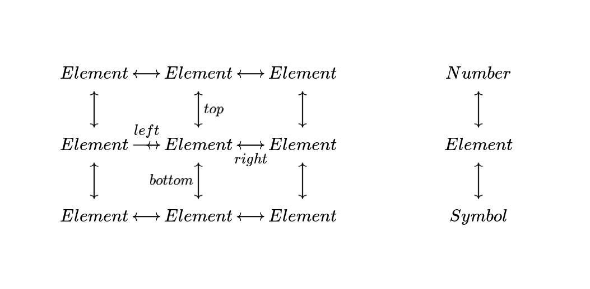

# Visualization the Periodic Table with Anki

This is a collection of flashcard decks I generated so that I could study the periodic table. I wrote it for use with [Anki](https://apps.ankiweb.net/), but csv files are available for other flashcard applications, just as long as those applications support html and use the same syntax for cloze completions.

I've had great luck going through these decks. I've gone through them several times now in Anki, all but a few cards have review intervals on the order of months, and now I think it's ready to share with others.

## Introduction 

This is not designed to be one of those pointless periodic table decks where you memorize obscure numbers for every element. It teaches the most important concept you have to remember: the behavior of chemical elements. 

Behavior, namely, through position. If you learn that Silicon is right below Carbon, it automatically tells you something about how Silicon behaves. The deck could be made simple by asking you to recite a list of elements for every group, but list-based answers like that don't make for good flash cards. 

Flash cards work best when you want to store mappings in your head: functions, to be precise. In set theory, a function F: A->B is a set of tuples, like { (1,a), (2,a), (3,b) }, that maps each value from A to some value from another set B, so that no value from A is omitted or repeated. If you can condense a subject down to a set of those functions, and you finish going through a deck that encodes those functions, then you can truly say you know that subject, which makes it very encouraging and rewarding to learn. Even better is when these functions can reinforce themselves, forming dense [commutative diagrams](https://en.wikipedia.org/wiki/Commutative_diagram) where functions may compose in several different ways to arrive at the same results.

If you do want to store a list in your head, it's best to store it as a linked list: a mapping where for each element there's a single successor element. If you want to recall a list forwards and backwards, you actually remember two mappings: one that produces successor elements, and another that produces preceding elements. It's much easier to remember things this way, since each card requires you to remember less, and the functions reinforce each other.

In the case of the periodic table, you might also want to know the element left or right of another. This is for, say, remembering nucleosynthesis processes, or maybe for when your friends want to test your knowledge by reciting the table in order. So you now have four mappings:

* given an element, produce the element below
* given an element, produce the element above
* given an element, produce the element to the left
* given an element, produce the element to the right

This works even better than a linked list, since now we have four functions that reinforce themselves. If you forget what element comes after Silicon, for instance, you might be able to trace your way around it: Carbon is above Silicon, Nitrogen comes after Carbon, and Phosphorus is beneath Nitrogen, so the answer must be Phosphorus.

So in short, we're going to be learning how to visualize the table. 

The four functions above are stored within a flashcard deck called "positions.csv". It represents functions using cloze completions of elements as they would appear in the periodic table. This way, you can learn the periodic table using a combination of visual and textual cues, picking whichever cues you prefer to focus on, or leveraging both. Elements are depicted using html to maximize portability: unlike other decks that contain images, this deck will render correctly if you take it to another computer using Anki's sync functionality. 

I recommend you learn the "positions" deck in order. I've ordered the deck roughly by how frequent the elements occur in the universe, so the first things you remember should be the most applicable to real life. This way, if you get bored and don't want to learn the deck anymore you've still maximized the value you'll have gotten out of it. 

## Atomic Numbers and Symbols

You might also be wondering what to do if you want to learn atomic numbers or symbols. I've created separate decks, "numbers.csv" and "symbols.csv", that store additional functions:

* given an element, produce the element's symbol
* given a symbol, produce the element
* given an atomic number, produce the corresponding element
* given an element, produce its atomic number

So all told, our commutative diagram looks something like [this](https://q.uiver.app/?q=WzAsMTIsWzEsMSwiRWxlbWVudCJdLFsxLDIsIkVsZW1lbnQiXSxbMiwxLCJFbGVtZW50Il0sWzIsMiwiRWxlbWVudCJdLFsyLDAsIkVsZW1lbnQiXSxbMSwwLCJFbGVtZW50Il0sWzAsMCwiRWxlbWVudCJdLFswLDEsIkVsZW1lbnQiXSxbMCwyLCJFbGVtZW50Il0sWzQsMSwiRWxlbWVudCJdLFs0LDAsIk51bWJlciJdLFs0LDIsIlN5bWJvbCJdLFswLDFdLFsxLDAsImJvdHRvbSJdLFsxLDNdLFszLDFdLFszLDJdLFsyLDNdLFsyLDBdLFswLDIsInJpZ2h0IiwyXSxbMiw0XSxbNCwyXSxbNCw1XSxbNSw0XSxbNSwwXSxbMCw1LCJ0b3AiLDJdLFs1LDZdLFs2LDVdLFs2LDddLFs3LDZdLFs3LDhdLFs4LDddLFs3LDAsImxlZnQiXSxbOCwxXSxbMSw4XSxbOSwxMV0sWzExLDldLFs5LDEwXSxbMTAsOV0sWzAsMzIsIiIsMSx7ImxldmVsIjoxfV1d):



I recommend studying these at the same time you're going through the "positions" deck, and tweak the "New cards/day" setting for these decks to be half that of the "positions" deck. This way their content will keep sync as you go through them.

## Atomic Weights

Lastly, I don't have a deck for atomic weights, nor any other atomic properties, since these were never something I wanted to focus on. Atomic weights are much harder to remember, they are much less useful, and if pressed they can always be approximated by multiplying atomic number by two. I'm really hesitant to create a new deck for atomic weights, since I'm worried that inexperienced users will try to go through it anyway and will burn out having learned much less in the process. Fortunately though, I've uploaded all the script files I used to generate these decks, so enterprising Anki users can always create these decks if they want to.

## Creating Your Own Decks

The "positions", "numbers", and "symbols" decks are all generated from python scripts with those same names. These scripts are extremely simple. No requirements are needed to run these script besides Python 3, and all script output is sent to the command line. You'll have to pipe output manually to a csv file so that you can get something to upload to Anki, e.g.:

```
python3 positions.py > positions.csv
```

All scripts get their data from "tools.py", which parses the csv files in the directory and stores their contents into global variables. I have no intention to improve upon this process since the scripts are throwaway and their simplicity helps others get up and running.
